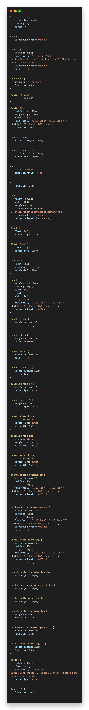

# Horisone-marketing

## Introduction

Horisone-marketing webpage is a refractation of an existing webpage making it accessible and search Engine optimized. It takes advantage of the work already done page to generate a new and improved webpage. The new webpage provides equal access and equal opportunity to people with diverse abilities.

The new and improved Horiseon-marketing webpage uses proper semantic elements, alternative text for images, logical structure of elements with cleaner style and positioning.

## what

The new wepage 
 - follows new semantic structure of elements.
 - cleans up the css.
 - consolidated CSS Selectors and properites.
 - adds alternative text to images.
 
 making the wepage Search engine optimized and accesible.

 - For description of the old code : screenshoots                                                           CSS Screenshot

 - The new and improved webpage [Horiseon-marketing](https://robel-codes.github.io/horiseon-marketing/).
